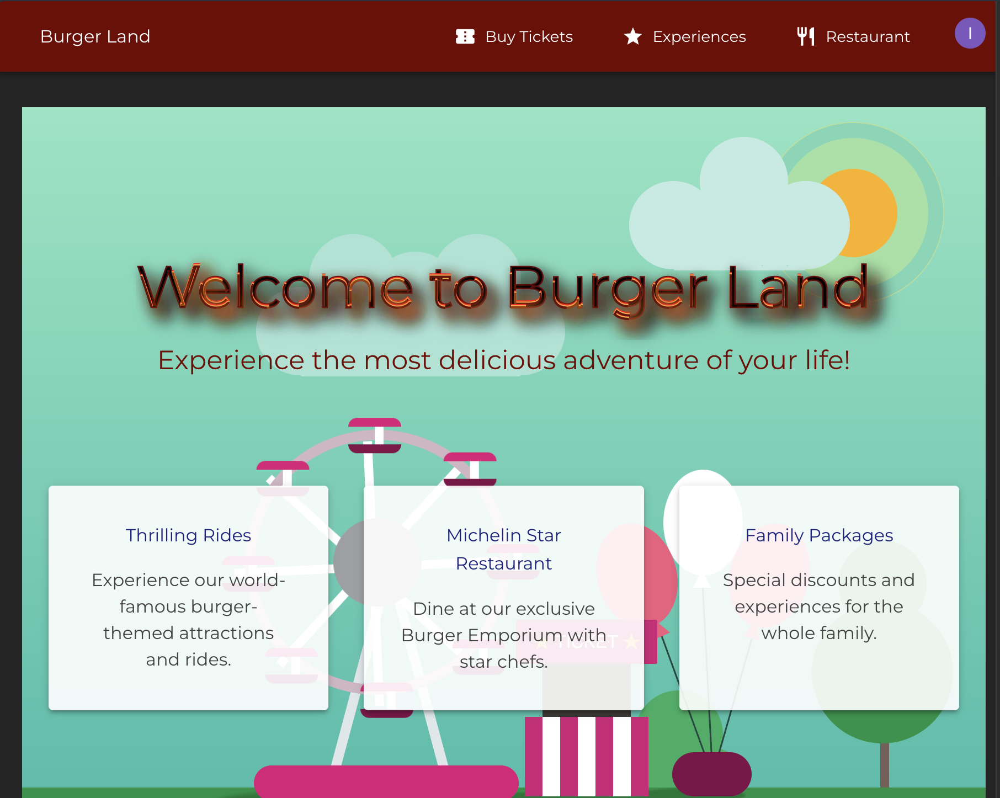

# Burger Land - Theme Park Ticketing System



## Overview
Burger Land is a modern theme park ticketing and reservation system built with React and TypeScript. The application provides a seamless experience for visitors to purchase tickets, book restaurants, and manage their theme park experiences.

## Features

### Core Functionality
- **Ticket Booking**
  - Single and multi-day passes
  - Family package discounts
  - Season passes
  - Group bookings

- **Restaurant Reservations**
  - Real-time availability
  - Special dietary requirements
  - Theme-based dining experiences
  - Group booking management

- **Experience Management**
  - VIP tours booking
  - Special events registration
  - Fast-track passes
  - Show schedules

### Technical Features
- Secure authentication via Clerk
- Responsive Material-UI design
- Form validation with Formik and Yup
- Type-safe development with TypeScript
- Automated testing with Jest and Testing Library
- Internationalization support

## Architecture

### High-Level System Design
```
┌─────────────────┐     ┌──────────────┐     ┌─────────────┐
│   React Client  │────▶│  Clerk Auth  │────▶│  API Layer  │
└─────────────────┘     └──────────────┘     └─────────────┘
         │                                          │
         ▼                                          ▼
┌─────────────────┐                         ┌─────────────┐
│  State Manager  │◀────────────────────────│  Services  │
└─────────────────┘                         └─────────────┘
```

### Infrastructure Diagram
```
┌─────────────┐     ┌─────────────┐     ┌──────────────┐
│   Vite Dev  │────▶│   CI/CD    │────▶│  Production  │
│   Server    │     │  Pipeline   │     │    Server    │
└─────────────┘     └─────────────┘     └──────────────┘
                           │                    │
                           ▼                    ▼
                    ┌─────────────┐     ┌──────────────┐
                    │   Testing   │     │   Monitoring │
                    │Environment  │     │  & Logging   │
                    └─────────────┘     └──────────────┘
```

## Technology Stack

### Frontend
- React 19.0.0
- TypeScript 5.7.2
- Material-UI 6.4.6
- Vite 6.2.0
- React Router DOM 7.2.0

### Authentication & Forms
- Clerk Authentication
- Formik for form management
- Yup for validation

### Testing
- Jest
- React Testing Library
- Testing Library User Event

### Development Tools
- ESLint with TypeScript support
- Vite for development and building
- SASS for styling

## Security & Privacy

### Authentication
- Secure user authentication via Clerk
- Protected routes implementation
- Session management
- Role-based access control

### Data Protection
- HTTPS encryption
- Secure form handling
- Input sanitization
- XSS protection

### Privacy Compliance
- GDPR compliance
- Cookie consent management
- Data minimization
- User data encryption

## Code Documentation

### Project Structure
```
src/
├── components/       # Reusable UI components
├── pages/            # Route components
├── config/           # Configuration files
├── routes/           # Routing setup
├── theme/            # UI theming
├── types/            # TypeScript definitions
└── assets/           # Static resources
```

### Key Components
- `ProtectedRoute`: Handles authentication routing
- `Layout`: Main application layout
- `HomePage`: Landing page component
- `TicketBooking`: Ticket purchase flow
- `RestaurantBooking`: Restaurant reservation system
- `Experiences`: Special events and experiences

## Getting Started

### Prerequisites
- Node.js 18+
- npm or yarn

### Installation
```bash
# Clone the repository
git clone [repository-url]

# Install dependencies
npm install

# Start development server
npm run dev

# Run tests
npm test

# Build for production
npm run build
```

### Environment Setup
Create a `.env` file with the following variables:
```
VITE_CLERK_PUBLISHABLE_KEY=your_clerk_key
VITE_API_URL=your_api_url
```

## Contributing
Please read our contributing guidelines before submitting pull requests.

## License
This project is licensed under the MIT License.
